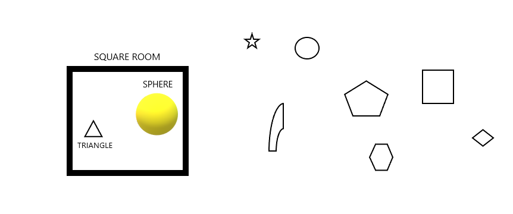

### Many people talk about the existence of higher dimensions of space for a better understanding of our reality. We know the three spatial dimensions we see in our day-to-day lives: length, breadth, and depth. But if a fourth or higher dimension exists, how do we describe them? Can we perceive these higher dimensions, and how do we visualize them?

Let us conduct a thought experiment to visualize the spatial dimensions. Imagine a single dot on a line, and there is nothing else in its surroundings. You can only move in a straight line (from the dot’s perspective), either forwards or backward. The dot finds that its whole universe is a single-dimensional line on which it can go forwards or back. This visualization corresponds to one dimension.

Now imagine any shape like a square or a triangle. Imagine there are other shapes around it. There are many rectangles, parallelograms, trapeziums, and all the shapes you can think of. These all shapes reside in a single plane, able to move forwards, backward, and sideways. But they cannot fathom anything above or below their plane of life. This plane is what we recognize as a two-dimensional plane. These shape “beings” can perceive only two dimensions.

Now imagine solid shapes like a cube or a sphere or even us. We can visualize three dimensions easily, length, breadth, and depth. We can be called three – dimensional beings. We cannot perceive any higher dimensions.

Although a two-dimensional being cannot perceive the third dimension, the third dimension still exists. Now imagine how a two-dimensional being can be made aware of a higher dimension. Let’s go to the two-dimensional plane and look from a two-dimensional shape’s perspective (say, a triangle). Imagine being in a room that is a square box. We look around, and all we can see is the straight-line walls of our room. Now suppose a sphere is placed on that square room. The triangle sees that magically another shape has appeared in the room! Here the figure would be a circle since the cross-section of the sphere is a circle. The triangle would be astonished that a circle appeared out of thin air.

We know that it isn’t a circle but a sphere of three dimensions that ‘descended’ to a two-dimensional plane. Now let the sphere move through the plane. The triangle sees the circle that had appeared is changing its radius without any perceivable actions. Now let the triangle cling onto the changing circle, and the sphere moves above the plane. The triangle now realizes the circle it was clasping on was a sphere, and from above, it can see its plane of two-dimensional shapes. The box room is empty, and the other shapes can never figure out how the triangle disappeared in thin air.

Similarly, we as three-dimensional beings can maybe never see the fourth dimension. Still, we can perceive a ‘shadow’ of the fourth dimension, just like the cross-sectional circle in two dimensions. Thus, the shadow of a three-dimensional object is a two – dimensional shape. Similarly, the shadow of a four-dimensional object should be a three-dimensional object. Let’s take a cube, for example. The shadow of a cube is a two-dimensional shape. For the shadow of a four-dimensional object to be a cube, the object is proposed to be a tesseract. A tesseract is a shape whose shadow or cross-section is a cube.

*In conclusion, maybe we could not perceive the fourth dimension of space for now. But perhaps in the future, we can visualize the higher dimensions.*