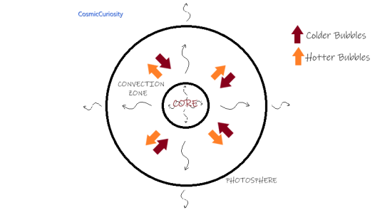

### A star emits energy using radiation transfer, and there is a convection zone in the star’s sub-photospheric layers. Let us see why a convection zone is present and how convection works in low mass stars, such as in the Sun.

The effective temperature required to radiate a luminosity equal to the solar luminosity from a sphere of radius equal to the solar radius is about 5800 Kelvins. At the photospheric temperatures and pressures, characteristic to the Sun, the valence electrons of metals get easily detached. However, at the Sun’s relatively low sub-photospheric temperature, the hydrogen atoms prefer to remain neutral. The reason is simple: atoms tend to be more bound at lower temperatures than at higher temperatures. These hydrogen atoms have a weak tendency to add one of the electrons released by the metals to complete their outer shell, thus forming a hydronium ion (H-). Thus in the photosphere of Sun and all such stars, hydrogen exists partially in hydronium ion.

Hydronium ion is a significant source for continuum opacity. Because of this, in the outer layers of the star, there is so much resistance to the free flow of outward radiation that radiative transfer or radiative transport alone cannot carry the requisite amount stably required for net energy balance. Consequently, a zone develops in photospheric and sub-photospheric layers in which convection of energy occurs.

In the convection zone, bubbles of gas, which happen to be hotter than their surroundings, are buoyant and rise, whereas the bubbles, which happen to be cooler than their surrounding, sink. Statistically, there is no net transfer of mass by the rising and sinking bubbles, but there is a net outward transfer of heat (convective transfer). The Sun’s outer convective zone extends about one-third of the way into the center, i.e., the convective zone occupies about 70.37% of the total volume. Very cool stars may even be completely convective.

_Hotter bubbles move outwards (rise) whereas the colder bubbles move inwards (sink)._

The energy produced in the core enters the base of the convection zone. The high opacity regions of the convection zone find it challenging to carry outward without producing conditions that induce convection. The net effect is to produce a convective heat flux that helps to carry out the requisite amount of energy per second for the star. Convection is inefficient in the Sun’s photosphere, i.e., above the convective zone, and the power generated in the core is ultimately carried away almost by radiation on the surface. A small amount of energy is carried outward by mechanical waves in the material medium.
Thus the photons are termed as “walking” in this convection zone and then “flying” as they exit the convection zone. The surface from where the photons start “flying” is termed as the photosphere.